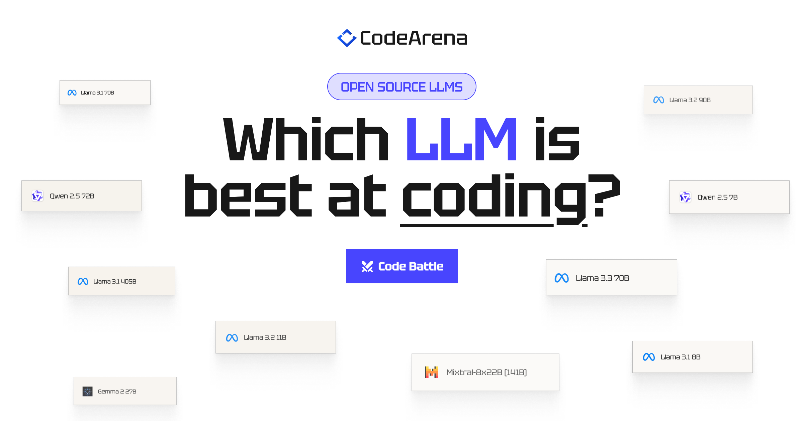

<a href="https://www.llmcodearena.com">
  
  <h1 align="center">CodeArena</h1>
</a>

  Watch LLMs battle to build the same app and see a live leaderboard of the best OSS coding LLMs.

## Tech stack

- LLMs on [Together AI](https://dub.sh/together-ai) on Together AI to generate code
- [Sandpack](https://sandpack.codesandbox.io/) for rendering the UI code
- [Next.js](https://nextjs.org/) with TypeScript for the app framework
- [Shadcn](https://ui.shadcn.com/) for UI components & [Tailwind](https://tailwindcss.com/) for styling
- [Plausible](https://plausible.io/) & [Helicone](https://helicone.ai/) for analytics & observability

## Cloning & running

1. Clone the repo: `git clone https://github.com/Nutlope/codearena`
2. Create a `.env` file and add your [Together AI API key](https://api.together.xyz/settings/api-keys): `TOGETHER_API_KEY=`
3. Create a postgres DB (I recommend [Neon](https://neon.tech/)) and add connection details to `.env`: `DATABASE_URL=`
4. Run `npm install` and `npm run dev` to install dependencies and run locally.

## Future tasks

- [ ] Add two chained LLM calls generations for better results (also do a DB migration to tag each app/battle with single/multi calls)
- [ ] Add Elo scores
- [ ] Add the abilty to generate + run scripts
